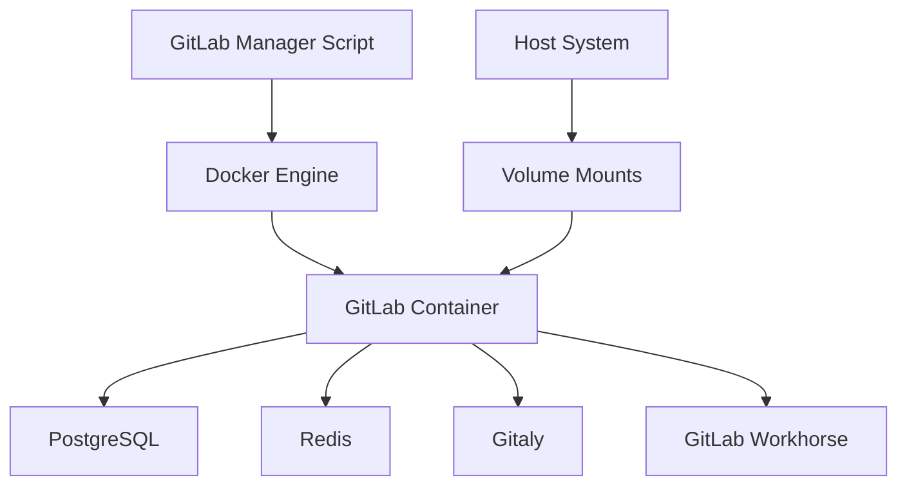

# GitLab Docker Manager

A comprehensive, cross-platform shell script for managing portable GitLab instances using Docker. Designed for developers who need a reliable, easily migrable GitLab server that can be moved between machines with minimal effort.

[](https://opensource.org/licenses/MIT)
[](https://www.zsh.org/)
[]()
[](https://www.docker.com/)

## 🚀 Features

### 🛡️ **Enterprise-Grade Reliability**
- **Comprehensive error handling** with detailed logging
- **Automatic backups** before critical operations
- **Health checks** and service monitoring
- **Rollback capabilities** for failed operations
- **Dependency validation** and OS compatibility checks

### 📦 **Easy Migration & Portability**
- **One-command migration** preparation with auto-generated installers
- **Self-contained packages** including all data and configurations
- **Cross-platform compatibility** (Linux/macOS)
- **Zero-downtime migrations** with automated setup

### 🎛️ **User-Friendly Interface**
- **Interactive menu** for beginners
- **Command-line interface** for automation and scripting
- **Colored output** with progress indicators
- **Comprehensive help system** with examples

### 💾 **Advanced Backup & Recovery**
- **Full system backups** including all GitLab data
- **GitLab-native backups** for database consistency
- **One-command restore** with automatic rollback
- **Backup management** and listing utilities

### 🔧 **Maintenance & Monitoring**
- **Resource usage tracking** and optimization
- **Log aggregation** and analysis
- **Automatic updates** with backup protection
- **System cleanup** and maintenance routines

## 📋 Requirements

### System Requirements
- **Operating System**: Linux or macOS
- **Shell**: Zsh (default on macOS 10.15+, available on all Linux distributions)
- **Memory**: 4GB+ recommended for GitLab
- **Storage**: 10GB+ free space
- **Network**: Internet connection for initial setup

### Dependencies
- **Docker**: 20.10.0+ ([Installation Guide](https://docs.docker.com/get-docker/))
- **Docker Compose**: 2.0.0+ (included with Docker Desktop)

### Supported Platforms
| Platform | Version | Status | Notes |
|----------|---------|--------|-------|
| macOS | 10.15+ | ✅ Fully Supported | Tested on Intel and Apple Silicon |
| Ubuntu | 18.04+ | ✅ Fully Supported | |
| Debian | 10+ | ✅ Fully Supported | |
| CentOS/RHEL | 7+ | ✅ Fully Supported | |
| Fedora | 32+ | ✅ Fully Supported | |
| Arch Linux | Latest | ✅ Fully Supported | |

## 🚀 Quick Start

### 1. Installation

```bash
# Download the script
curl -o gitlab-manager.sh https://raw.githubusercontent.com/[your-repo]/gitlab-docker-manager/main/gitlab-manager.sh

# Make it executable
chmod +x gitlab-manager.sh

# Optional: Install globally
sudo mv gitlab-manager.sh /usr/local/bin/gitlab-manager
```

### 2. Initial Setup

```bash
# Interactive setup (recommended for first-time users)
./gitlab-manager.sh

# Or direct setup
./gitlab-manager.sh setup
```

### 3. Start GitLab

```bash
# Start the server
./gitlab-manager.sh start

# Check status
./gitlab-manager.sh status

# Get initial root password
./gitlab-manager.sh password
```

### 4. Access GitLab

Open your browser and navigate to:
- **Local access**: http://gitlab.local
- **Network access**: http://[your-ip-address]

**Default credentials:**
- Username: `root`
- Password: Use `./gitlab-manager.sh password` to retrieve

## 📖 Usage Guide

### Interactive Mode

For beginners, simply run the script without arguments to access the interactive menu:

```bash
./gitlab-manager.sh
```

```
GitLab Docker Manager
=====================
1. Setup GitLab
2. Start GitLab
3. Stop GitLab
4. Restart GitLab
5. Show Status
6. Show Logs
7. Get Root Password
8. Create Backup
9. Prepare Migration
10. Update GitLab
0. Exit

Select an option [0-10]:
```

### Command Line Interface

For automation and advanced users:

```bash
# Core Operations
./gitlab-manager.sh setup              # Initial setup
./gitlab-manager.sh start              # Start GitLab
./gitlab-manager.sh stop               # Stop GitLab
./gitlab-manager.sh restart            # Restart GitLab
./gitlab-manager.sh status             # Show status

# Monitoring & Logs
./gitlab-manager.sh logs               # Show last 100 log lines
./gitlab-manager.sh logs 50            # Show last 50 log lines
./gitlab-manager.sh password           # Get root password

# Backup & Recovery
./gitlab-manager.sh backup             # Create full backup
./gitlab-manager.sh list-backups       # List available backups
./gitlab-manager.sh restore backup.tar.gz  # Restore from backup

# Migration & Maintenance
./gitlab-manager.sh migrate            # Prepare migration package
./gitlab-manager.sh update             # Update GitLab
./gitlab-manager.sh reset-password     # Reset root password

# Cleanup
./gitlab-manager.sh cleanup            # Clean Docker resources
./gitlab-manager.sh uninstall          # Complete removal
```

## 🔧 Configuration

### Environment Variables

| Variable | Default | Description |
|----------|---------|-------------|
| `GITLAB_HOME` | `$HOME/gitlab_docker` | GitLab installation directory |
| `GITLAB_HOSTNAME` | `gitlab.local` | Hostname for GitLab server |

### Example Configuration

```bash
# Custom configuration
export GITLAB_HOME="/opt/gitlab"
export GITLAB_HOSTNAME="dev-gitlab.local"
./gitlab-manager.sh setup
```

### Network Configuration

#### Local Access Only (Default)
- Access via `http://gitlab.local`
- Automatic hosts file configuration

#### Network Access
To allow access from other devices on your network:

1. Find your machine's IP address:
   ```bash
   # macOS
   ifconfig | grep "inet " | grep -v 127.0.0.1
   
   # Linux
   ip addr show | grep "inet " | grep -v 127.0.0.1
   ```

2. Update GitLab configuration:
   ```bash
   export GITLAB_HOSTNAME="your-ip-address"
   ./gitlab-manager.sh restart
   ```

## 📦 Migration Guide

### Preparing for Migration

1. **Create migration package**:
   ```bash
   ./gitlab-manager.sh migrate
   ```

2. **This creates**:
   - `gitlab-migration-[timestamp].tar.gz` - Complete GitLab archive
   - `gitlab-migration-[timestamp]-install.sh` - Auto-installer script

### Migrating to New Machine

1. **Copy files to target machine**:
   ```bash
   scp gitlab-migration-*.tar.gz gitlab-migration-*-install.sh user@target-machine:~/
   ```

2. **On target machine, run installer**:
   ```bash
   chmod +x gitlab-migration-*-install.sh
   ./gitlab-migration-*-install.sh
   ```

3. **Verify migration**:
   ```bash
   ./gitlab-manager.sh status
   ```

### Migration Checklist

- [ ] Source machine has Docker and GitLab running
- [ ] Target machine has Docker installed
- [ ] Sufficient disk space on target machine
- [ ] Network connectivity between machines
- [ ] Both files (archive + installer) copied to target

## 🔄 Backup & Recovery

### Creating Backups

```bash
# Create full backup (recommended)
./gitlab-manager.sh backup

# List all available backups
./gitlab-manager.sh list-backups
```

### Backup Types

| Type | Location | Description |
|------|----------|-------------|
| **Full Backup** | `$HOME/gitlab-full-backup-[timestamp].tar.gz` | Complete GitLab installation |
| **GitLab Internal** | `$GITLAB_HOME/backups/` | Database and repository backups |
| **Pre-operation** | Auto-created before updates/restores | Safety backups |

### Restoring from Backup

```bash
# Restore from full backup
./gitlab-manager.sh restore gitlab-full-backup-20241201-143022.tar.gz

# List available backups first
./gitlab-manager.sh list-backups
```

**⚠️ Warning**: Restore operations completely replace your current GitLab installation.

## 📊 Monitoring & Maintenance

### Status Monitoring

```bash
./gitlab-manager.sh status
```

**Example Output**:
```
GitLab Status
==============

Docker Status:
       Name                     Command               State                 Ports
gitlab-server       /assets/wrapper                 Up (healthy)   0.0.0.0:22->22/tcp, 0.0.0.0:443->443/tcp, 0.0.0.0:80->80/tcp, 0.0.0.0:5050->5050/tcp

GitLab Services:
run: alertmanager: (pid 1234) 3600s; run: log: (pid 1235) 3600s
run: gitaly: (pid 1236) 3600s; run: log: (pid 1237) 3600s
run: gitlab-workhorse: (pid 1238) 3600s; run: log: (pid 1239) 3600s
...

Disk Usage:
2.1G    /Users/username/gitlab_docker/config
145M    /Users/username/gitlab_docker/logs
3.2G    /Users/username/gitlab_docker/data

Network:
ℹ GitLab URL: http://gitlab.local
ℹ Local network access: http://192.168.1.100
```

### Log Analysis

```bash
# Real-time logs
./gitlab-manager.sh logs

# Specific number of lines
./gitlab-manager.sh logs 200

# Follow logs (Ctrl+C to exit)
./gitlab-manager.sh logs 50
```

### Updates

```bash
# Update to latest GitLab version
./gitlab-manager.sh update
```

**Note**: Automatic backup is created before updating.

## 🛠️ Troubleshooting

### Common Issues

#### GitLab Won't Start

**Symptoms**: Container starts but GitLab doesn't respond
```bash
# Check logs
./gitlab-manager.sh logs

# Check system resources
docker system df
free -h  # Linux
vm_stat  # macOS
```

**Solutions**:
- Ensure 4GB+ RAM available
- Check disk space (10GB+ required)
- Wait longer (initial startup takes 5-10 minutes)

#### Cannot Access GitLab

**Symptoms**: Browser can't reach http://gitlab.local
```bash
# Verify hosts file
cat /etc/hosts | grep gitlab

# Check container status
./gitlab-manager.sh status

# Verify ports
netstat -tlnp | grep -E '(80|443|2222|5050)'
```

**Solutions**:
- Run `./gitlab-manager.sh setup` again
- Check firewall settings
- Try IP address instead of hostname

#### Migration Fails

**Symptoms**: Migration installer reports errors
```bash
# Check available space
df -h

# Verify archive integrity
tar -tzf gitlab-migration-*.tar.gz > /dev/null

# Check Docker status
docker version
```

**Solutions**:
- Ensure sufficient disk space
- Re-download archive if corrupted
- Install/start Docker on target machine

### Getting Help

1. **Check logs**: `./gitlab-manager.sh logs`
2. **Review status**: `./gitlab-manager.sh status`
3. **Verify setup**: `./gitlab-manager.sh setup`
4. **Create issue**: Include logs and system information

### System Information

```bash
# Gather diagnostic information
echo "OS: $(uname -a)"
echo "Docker: $(docker --version)"
echo "Docker Compose: $(docker-compose --version)"
echo "Disk Space: $(df -h $HOME)"
echo "Memory: $(free -h 2>/dev/null || vm_stat)"
./gitlab-manager.sh status
```

## 🔐 Security Considerations

### Password Management

```bash
# Change root password after first login
./gitlab-manager.sh reset-password

# Get current password
./gitlab-manager.sh password
```

### Network Security

- Default configuration only allows local access
- For network access, consider using HTTPS
- Regular backups protect against data loss
- Keep GitLab updated for security patches

### File Permissions

The script automatically sets appropriate permissions:
- GitLab data: `$HOME/gitlab_docker/`
- Logs: `$HOME/gitlab_docker/gitlab-manager.log`
- Backups: `$HOME/gitlab-full-backup-*.tar.gz`

## 🏗️ Architecture

### Directory Structure

```
$HOME/gitlab_docker/
├── docker-compose.yml          # Docker Compose configuration
├── gitlab-manager.log          # Script logs
├── config/                     # GitLab configuration
├── logs/                       # GitLab logs
├── data/                       # GitLab data and repositories
└── backups/                    # GitLab internal backups
```

### Docker Configuration

- **Image**: `gitlab/gitlab-ce:latest`
- **Memory**: 4GB limit, 2GB reservation
- **Ports**: 80 (HTTP), 443 (HTTPS), 2222 (SSH), 5050 (Registry)
- **Networks**: Isolated Docker network
- **Health Checks**: Automated container health monitoring

### Service Dependencies



## 🤝 Contributing

We welcome contributions! Here's how you can help:

### Reporting Issues

1. Check existing issues first
2. Include system information:
   ```bash
   uname -a
   docker --version
   ./gitlab-manager.sh status
   ```
3. Provide relevant logs and error messages

### Feature Requests

- Describe the use case
- Explain expected behavior
- Consider backward compatibility

### Development

1. Fork the repository
2. Create a feature branch
3. Test on both Linux and macOS
4. Submit a pull request

### Testing

```bash
# Run basic tests
./gitlab-manager.sh setup
./gitlab-manager.sh start
./gitlab-manager.sh status
./gitlab-manager.sh backup
./gitlab-manager.sh stop
```

## 📄 License

This project is licensed under the MIT License - see the [LICENSE](LICENSE) file for details.

## 🙏 Acknowledgments

- [GitLab](https://gitlab.com/) for the amazing DevOps platform
- [Docker](https://www.docker.com/) for containerization technology
- The open-source community for inspiration and feedback

## 📚 Additional Resources

### Documentation Links
- [GitLab Documentation](https://docs.gitlab.com/)
- [Docker Documentation](https://docs.docker.com/)
- [GitLab Docker Images](https://docs.gitlab.com/ee/install/docker.html)

### Community
- [GitLab Community Forum](https://forum.gitlab.com/)
- [Docker Community](https://www.docker.com/community/)

### Related Projects
- [GitLab Runner](https://docs.gitlab.com/runner/) - CI/CD runner
- [GitLab Helm Chart](https://docs.gitlab.com/charts/) - Kubernetes deployment

---

**Made with ❤️ for the developer community**

*If this project helped you, please consider giving it a ⭐ on GitHub!*